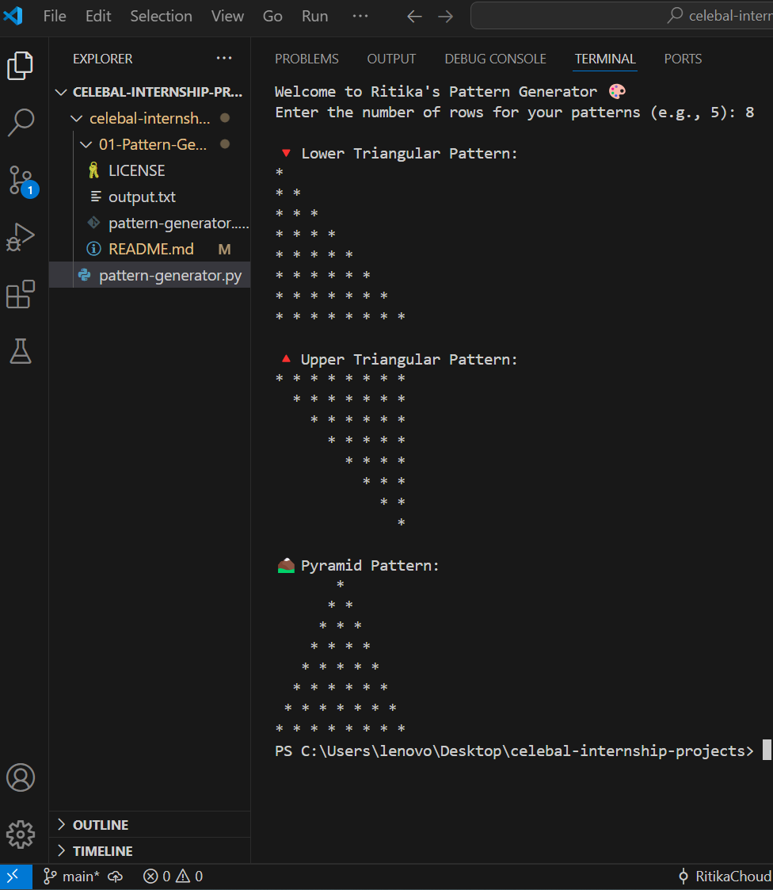

#  Patterns with Stars by Ritika Choudhary

Welcome to **Ritika's Pattern Generator** – a simple yet elegant Python script that creates visually appealing star (`*`) patterns directly in your terminal! Whether you're a beginner learning loops or a developer revisiting the joy of pattern printing, this script offers a quick and fun experience.

##  About the Project

This program allows you to generate:

-  **Lower Triangular Pattern** (left-aligned triangle)
-  **Upper Triangular Pattern** (right-aligned triangle)
-   **Pyramid Pattern** (centered, symmetric)

It takes a user-defined number of rows and dynamically prints these star patterns.

## 📸 Sample Output

Here's what the patterns look like:

---

##  File Structure

