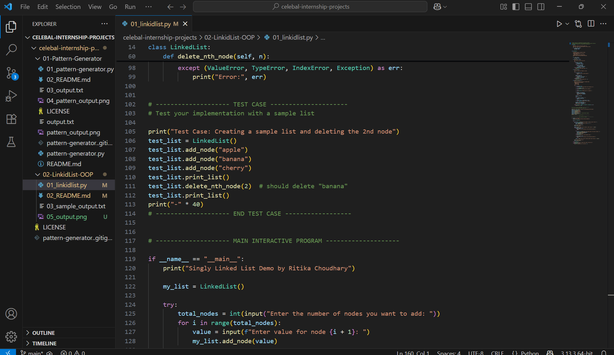
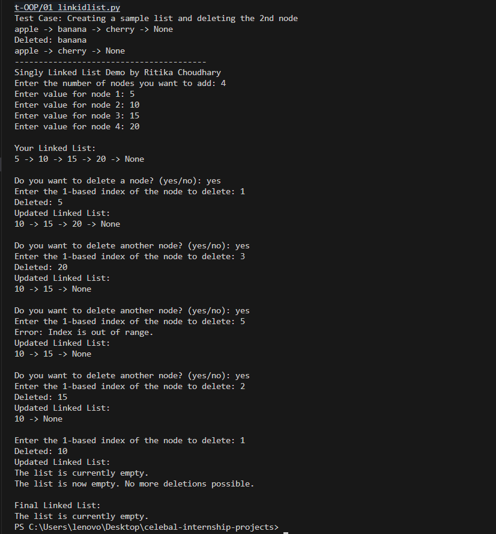

# 🧵 Singly Linked List in Python (OOP)

This repository contains a Python implementation of a **Singly Linked List** using OOP principles.  
It supports adding, printing, and deleting nodes with robust exception handling.

---

## 📂 Files in This Repository

| File Name               | Description                                       |
|------------------------|---------------------------------------------------|
| [`linked_list.py`](linked_list.py)       | Main Python implementation                    |
| [`04_linked_list_demo.gif`](04_linked_list_demo.gif) | GIF demo of the interactive CLI run         |
| [`03_sample_output.txt`](03_sample_output.txt) | Sample terminal output of the program         |
| [`05_output.png`](05_output.png)        | Screenshot of program output                  |

---

## 📽️ Demo GIF

> Visual demonstration of interactive execution  
> _Click the image to view full size._



---

## 📸 Screenshot Output

> Static view of program output in terminal.



---

## 📄 Sample Output (Text Log)

Read full program output as plain text here:  
👉 [`03_sample_output.txt`](03_sample_output.txt)

---

## 🧪 Code Snippet from Test Case

```python
test_list = LinkedList()
test_list.add_node("apple")
test_list.add_node("banana")
test_list.add_node("cherry")
test_list.print_list()
test_list.delete_nth_node(2)
test_list.print_list()
