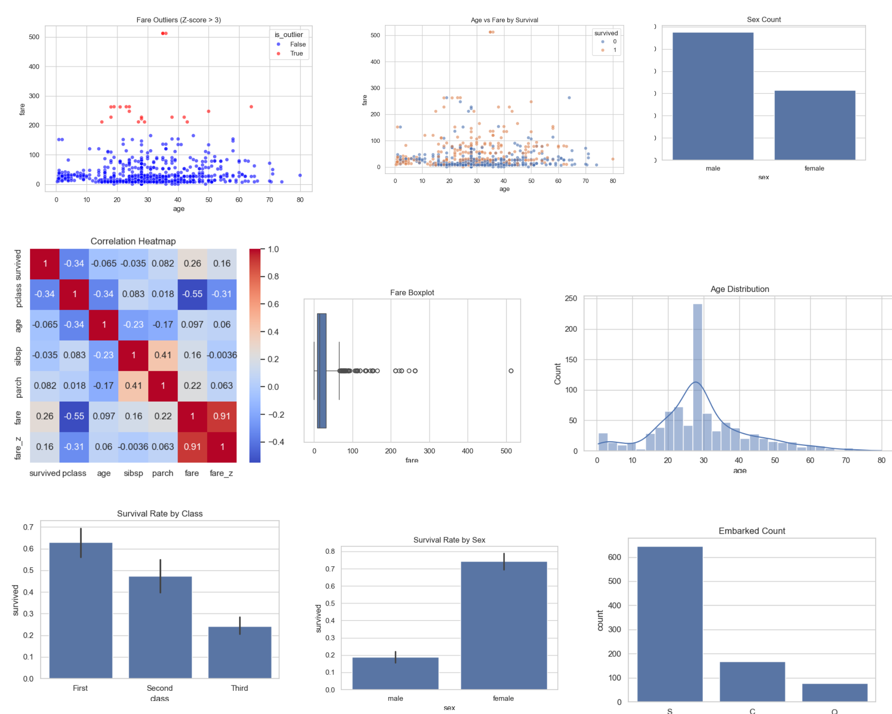

# 🧪 04_Exploratory_Data_Analysis – Titanic Dataset

This module is a part of my internship project at **Celebal Technologies**. It presents a comprehensive Exploratory Data Analysis (EDA) of the Titanic dataset using Python and standard data science libraries.

---

## 📸 Visual Preview

Here's a snapshot of some of the data visualizations generated:

---

## 🎯 Objective

To analyze the Titanic dataset and uncover key insights related to:
- Data distribution and structure
- Missing value patterns
- Outlier detection (using Z-score)
- Relationships between key variables
- Survival rates by gender, class, and port

---

## 📁 Folder Structure
