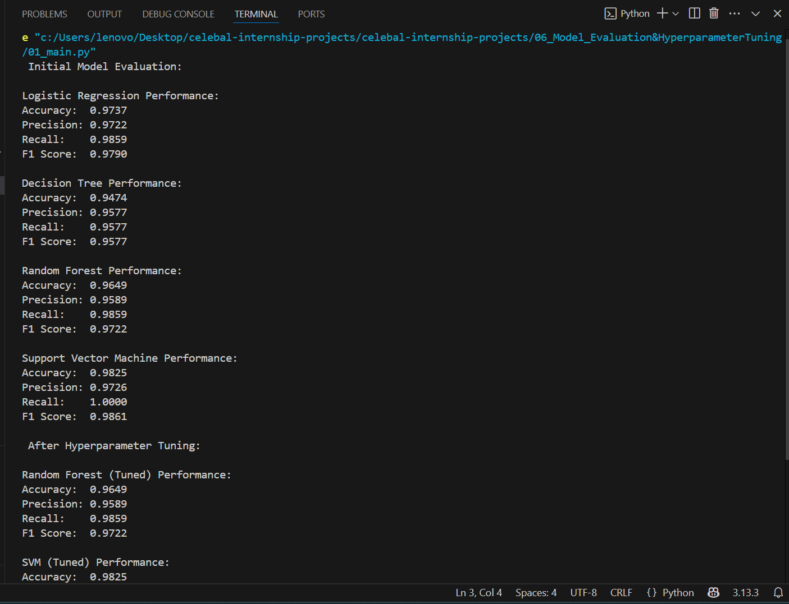
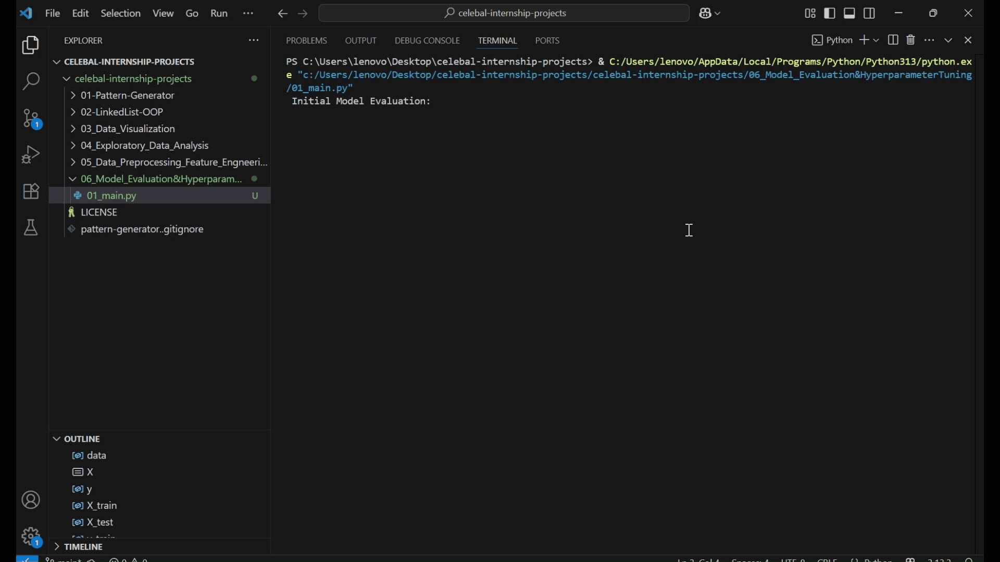

# 🔍 Model Evaluation and Hyperparameter Tuning

This project trains, evaluates, and tunes machine learning models using performance metrics such as **Accuracy, Precision, Recall, and F1-score**. The goal is to identify the best-performing model after applying hyperparameter optimization techniques like **GridSearchCV** and **RandomizedSearchCV**.

---



---

## 🎯 Objective

- Train multiple machine learning models
- Evaluate models using key metrics
- Optimize with GridSearchCV and RandomizedSearchCV
- Select the best model based on F1-score

---

## 📊 Models Used

- Logistic Regression
- Decision Tree
- Random Forest
- Support Vector Machine (SVM)

---

## 🧪 Tools & Techniques

- Dataset: Breast Cancer Wisconsin Dataset (from `sklearn.datasets`)
- Tuning:
  - GridSearchCV for Random Forest
  - RandomizedSearchCV for SVM
- Metrics:
  - Accuracy
  - Precision
  - Recall
  - F1 Score

---

## 🎥 Demo



---

## 📈 Results

| Model                 | Accuracy | Precision | Recall | F1 Score |
|----------------------|----------|-----------|--------|----------|
| Logistic Regression  | 0.9737   | 0.9722    | 0.9859 | 0.9790   |
| Decision Tree        | 0.9474   | 0.9577    | 0.9577 | 0.9577   |
| Random Forest        | 0.9649   | 0.9589    | 0.9859 | 0.9722   |
| **SVM (Tuned)** ✅    | **0.9825** | **0.9726** | **1.0000** | **0.9861** |

🏆 **Best Model:** Support Vector Machine (with tuning)

---

## 🚀 How to Run

```bash
pip install -r requirements.txt
python 01_main.py
